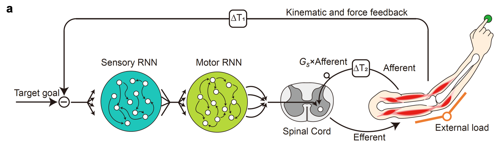

## Semester Project at the Mathis Group for Computational Neuroscience and AI - Parallel Feedback & Neural Limb Control

This repository implements a biologically plausible neural limb controller to investigate hierarchical motor control. It reproduces and extends the findings of the 2024 study **"Parallel feedback processing for voluntary control: knowledge of spinal feedback in motor cortex"** by Guang et al..

---

### 🎯 Core Objective

How does the nervous system coordinate fast, low-level spinal reflexes with slower, high-level cortical responses?

This project simulates a musculoskeletal arm model driven by a Recurrent Neural Network (RNN) cortex and a spinal reflex loop. The goal is to demonstrate "reciprocal reduction": the hypothesis that the motor cortex learns to "offload" control to spinal reflexes when those reflexes are strengthened by high background loads.

### 🧠 Methodology
For a deep dive into the neural network dimensions, spinal reflex equations, and muscle dynamics, please refer to the **[Technical Architecture specification](architecture.md)**.

 
**Figure 1: Model architecture.** Composed of recurrent neural networks (RNNs), a spinal reflex pathway, a two-segment musculoskeletal plant and proprioceptive feedback.

---

## 📊 Key Findings

By training the model for 3,000 epochs using differentiable physics, we successfully replicated the core biological predictions:

* **Robust Stabilization:** The controller converges to a robust policy that acts as a steep energy well, stabilizing the 2-DOF arm against random perturbations.
* **Impedance Control:** The model learns to completely compensate for high background loads, likely through co-contraction strategies that increase limb stiffness.
* **Reciprocal Reduction:** Crucially, we observe that the motor cortex reduces its activity during high-load conditions. It effectively "trusts" the strengthened spinal reflexes to handle stability, validating the efficiency hypothesis of hierarchical motor control.

> **Explore the Data:** For a detailed analysis of these results, see the **Summary** section at the end of `notebook/main.ipynb` or view the generated plots in `results/100_epochs/` and `results/3000_epochs/`.

---

## 🚀 Getting Started

### Prerequisites
The code is developed and tested on **Python 3.11.11**.

### Installation

1.  **Clone the repository:**
    ```bash
    git clone https://github.com/amathislab/parallel-feedback-processing.git
    cd parallel-feedback-processing
    ```

2.  **Set up the environment:**

    **Option A: Conda (Recommended)**
    Create a clean environment with the specific Python version and install dependencies:
    ```bash
    conda create -n parallel-feedback python=3.11.11
    conda activate parallel-feedback
    pip install -r requirements.txt
    ```

    **Option B: Pip**
    If you prefer using standard Python virtual environments:
    ```bash
    python3.11 -m venv venv
    source venv/bin/activate
    pip install -r requirements.txt
    ```

3.  **Run the Simulation:**
    You can run the full training loop directly via the script or interactively via the notebook:
    ```bash
    # Option 1: Run the python script directly
    python script/main.py
    
    # Option 2: Launch the interactive notebook
    jupyter notebook notebook/main.ipynb
    ```

---

## 📖 Recommended Workflow

1. **Main Simulation (Notebook):** Open `notebook/main.ipynb`. 
**Read this as the primary project report.** It intertwines the scientific theory, code implementation, and graphical analysis.
* **Context:** Explains the scientific background and model architecture.
* **Code:** Runs the full differentiable physics pipeline and training loop interactively.
* **Analysis:** Generates the cost evolution and trajectory comparison plots.

2. **Main Simulation (Script):** Alternatively, run `script/main.py` to execute the training loop directly from the terminal without the narrative context.

3. **Environment Mechanics:** Check `script/environment.py` to see the custom Gym environment, which implements the 2-DoF arm physics, Hill-type muscle dynamics, and moment arm geometry.

4. **Foundational Concepts:** To understand the specific reflex logic (Ia/Ib afferents, reciprocal inhibition), explore `notebook/stretch_reflex_toy.ipynb`. This notebook builds the reflex model complexity step-by-step.

5. **Alternative Approaches:** See `notebook/flexible_walker.ipynb` for an implementation based on the secondary reference (Ramadan et al.). Note: This notebook is experimental and not fully functional, but serves to illustrate alternative hierarchical control strategies.


---

## 📂 Repository Structure

```
.
├── README.md                      # Project overview and documentation
├── requirements.txt               # Install external dependencies
├── architecture.md                # Detailed technical specification of the model architecture
├── Guang_ParallelFeedback.pdf     # Primary reference article (Guang et al., 2024)
├── Ramadan_FlexibleWalker.pdf     # Secondary reference article (Ramadan et al.)
│
├── script/                        # Modular Python Scripts (Core Logic)
│   ├── main.py                    # Execution script (runs the training loop)
│   ├── config.py                  # Simulation constants and parameters
│   ├── environment.py             # Gym environment wrapper (MyoElbowPose2D6M)
│   ├── biomechanics.py            # Muscle models and physics dynamics
│   ├── neural_network.py          # RNN controller and feedback signal logic
│   ├── utils.py                   # Helper functions (buffers, seeding, costs)
│   └── visualization.py           # Plotting and analysis functions
│
├── notebook/                      # Jupyter Notebooks (Experiments & Analysis)
│   ├── main.ipynb                 # Full reproduction walkthrough (Context + Analysis)
│   ├── stretch_reflex_toy.ipynb   # Progressive reflex logic experiments
│   ├── flexible_walker.ipynb      # Alternative hierarchical strategy (Ramadan et al.)
│   └── intermediate_version.ipynb # Archived development steps
│
├── results/                       # Generated plots and metrics
│   ├── 100_epochs/                # Early-stage training plots
│   ├── 3000_epochs/               # Fully converged training plots
│   └── toy_model/                 # Outputs from reflex toy experiments
│
└── images/                        # Static assets
    ├── architecture.png           # Diargam of the model architecture
    └── flexible_walker.png        # Diagram of the flexible walker model
```

---

## 📚 References

```bibtex
@article{guang2024parallel,
      title={Parallel feedback processing for voluntary control: knowledge of spinal feedback in motor cortex}, 
      author={Hui Guang and Joseph Y. Nashed and J. Andrew Pruszynski and Hari Teja Kalidindi and Frederic Crevecoeur and Kevin P. Cross and Gunnar Blohm and Stephen H. Scott},
      journal={bioRxiv},
      year={2024},
      doi={10.1101/2024.05.12.593756},
      url={https://www.biorxiv.org/content/10.1101/2024.05.12.593756v1.full},
      publisher={Cold Spring Harbor Laboratory}
}

@article{ramadan2022neuromuscular,
      title={A neuromuscular model of human locomotion combines spinal reflex circuits with voluntary movements},
      author={Rachid Ramadan and Hartmut Geyer and John Jeka and Gregor Schöner and Hendrik Reimann},
      journal={Scientific Reports},
      year={2022},
      publisher={Nature Publishing Group},
      url={https://www.nature.com/articles/s41598-022-11102-1},
      doi={10.1038/s41598-022-11102-1}
}
```